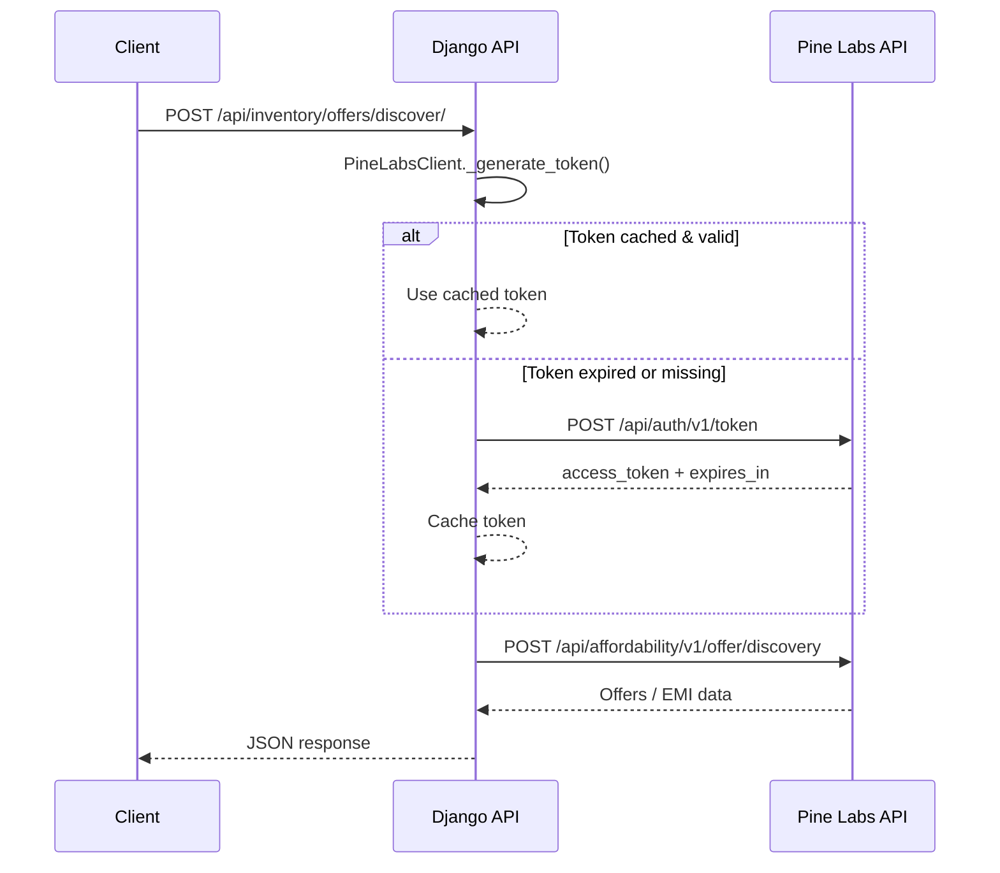

# Pine Labs Offer Discovery — Integration Walkthrough

## What was done

Integrated Pine Labs (Plural) **Generate Token** and **Offer Discovery** APIs into the Django ERP backend.

## Files Changed

| File | Change |
|------|--------|
| [pinelabs.py](file:///d:/ERP/backend/inventory/services/pinelabs.py) | **NEW** — `PineLabsClient` class with token generation + caching and offer discovery |
| [settings.py](file:///d:/ERP/backend/core/settings.py) | Added `PINELABS_BASE_URL`, `PINELABS_CLIENT_ID`, `PINELABS_CLIENT_SECRET` from env vars |
| [views.py](file:///d:/ERP/backend/inventory/views.py) | Added `OfferDiscoveryView` (APIView) |
| [urls.py](file:///d:/ERP/backend/inventory/urls.py) | Added `offers/discover/` route |
| [requirements.txt](file:///d:/ERP/backend/requirements.txt) | Added `requests` |

## Architecture



## How to Use

### 1. Set Environment Variables

Before running the server, set your Pine Labs credentials:

```powershell
$env:PINELABS_CLIENT_ID = "your-client-id"
$env:PINELABS_CLIENT_SECRET = "your-client-secret"
# Optional — defaults to UAT
$env:PINELABS_BASE_URL = "https://pluraluat.v2.pinepg.in"
```

### 2. Call the Endpoint

```bash
curl -X POST http://localhost:8000/api/inventory/offers/discover/ \
  -H "Content-Type: application/json" \
  -d '{
    "order_amount": 1200000,
    "currency": "INR",
    "bin": "60100000",
    "card_number": "4000000000000000",
    "customer_id": "cust-v1-250709071350-aa-1M9thA"
  }'
```

### 3. Response

The endpoint returns the raw JSON from Pine Labs Offer Discovery API (EMI options, offers, etc.).

## Validation

- `python manage.py check` — ✅ passed (only pre-existing W042 warnings)
- `requests` package already installed in venv
