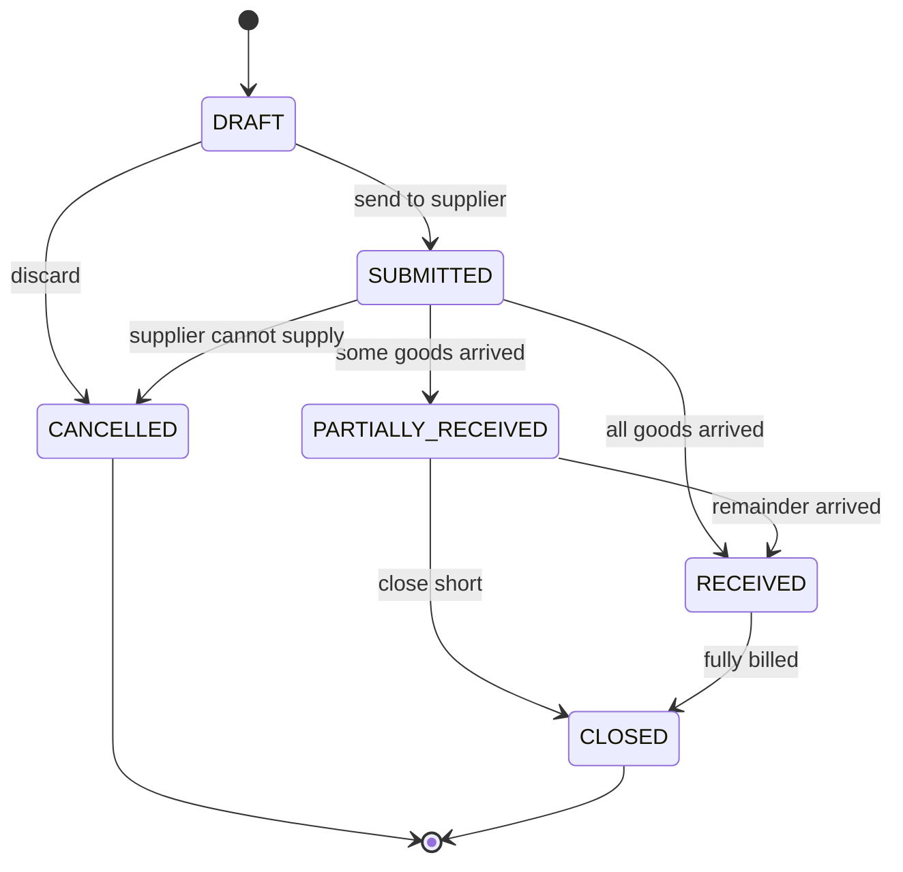
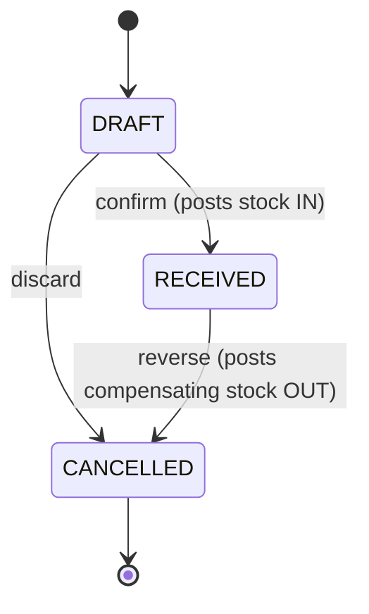

# Procure to pay

From deciding we need stock to paying the supplier for it.

The mirror of [order-to-cash](03-order-to-cash.md), and most decisions there apply here reversed.
Read that one first.

**Status:** design. `PurchaseOrder` and `POLineItem` exist; everything else is missing.

---

## Process

Stock runs low (or a customer orders something we don't hold) → we raise a purchase order with a
supplier → goods arrive, sometimes in several deliveries over weeks → we check what actually
arrived against what we ordered → the supplier bills us → we pay, often on 30-day terms.

The gap between *ordered*, *received*, and *billed* is the whole point. All three routinely differ:
you order 10, receive 7 now and 3 next month, and get billed for 7 on one invoice and 3 on another.

---

## Documents

| Document | Records | Stock effect | Money effect |
|---|---|---|---|
| **Purchase Order** | Our commitment to buy | none | none |
| **Goods Receipt (GRN)** | Goods physically arriving | **moves stock in** | none |
| **Bill / Purchase Invoice** | Supplier's demand for payment | none | creates payable |
| **Payment Out** | Money we paid | none | reduces payable |
| **Purchase Return** | Goods sent back | moves stock out | reduces payable (debit note) |

### The problem this fixes

`POLineItem.quantity_received` is a counter on the order line. It records *how many* arrived but not
*when*, *at what cost*, or *in how many deliveries*. So:

- Partial deliveries across dates can't be recorded — only a running total.
- There's no document to attach the supplier's delivery challan number to.
- **Purchase cost is never captured**, which is why stock valuation and margin are impossible
  anywhere in the system.

A `GoodsReceipt` document fixes all three. `quantity_received` then becomes derived — the sum of
receipt lines against that order line — rather than independently mutable.

---

## State machines

### Purchase Order

`CLOSED` again matters: the supplier delivers 7 of 10 and discontinues the model. The order is
neither cancelled nor complete.

### Goods Receipt

Cancelling a confirmed receipt does **not** delete the stock movement — it writes an opposite one.
The ledger is append-only.

---

## Invariants

| # | Rule | Enforced by |
|---|---|---|
| 1 | Received quantity never exceeds ordered, without explicit over-receipt approval | service guard |
| 2 | `po_line.quantity_received == sum(grn_lines for that po_line)` | derived, never stored raw |
| 3 | Confirming a GRN writes exactly one `StockMovement` per line | stock service only |
| 4 | Cancelling a GRN writes compensating movements, never deletes | service |
| 5 | A GRN line's `unit_cost` is immutable once confirmed | service guard |
| 6 | Billed quantity never exceeds received quantity | service guard |
| 7 | `sum(payments) <= bill.total` | DB constraint + service |
| 8 | A PO cannot be cancelled once any goods are received | service guard |

---

## Schema

See [`schema.dbml`](schema.dbml), *Procure to pay* group. New: `goods_receipt`,
`goods_receipt_line`. `bill` and `payment_out` follow the same shape as `invoice` and `payment` in
order-to-cash and are deferred until that module is settled — build them by symmetry, not by
inventing a second pattern.

`goods_receipt_line.unit_cost` is the single most valuable new column in this document. It is what
finally makes stock valuation, COGS, and margin computable.

---

## Open questions

**1. Do partial deliveries actually happen?** → Almost certainly yes with AC distributors. If they
genuinely never do, `GoodsReceipt` collapses into a flag on the PO and this module gets much
simpler.

**2. Does the supplier's bill always match the goods received?** Short-shipment, price differences,
freight charges added later. → Determines whether `Bill` needs its own lines or can just reference
GRN lines.

**3. Do you need supplier payment terms and an ageing report?** ("Net 30", "what do we owe, and when
is it due?") → *Recommend:* yes — a `payment_terms` field on the party and a due date on the bill.
Cheap, and it's the report that prevents late-payment problems.

**4. Is cost tracked per product or per receipt?** Per-receipt (each GRN line carries its own
`unit_cost`) is more accurate and enables real valuation. Per-product is one number that's wrong the
moment prices move. → *Recommend:* **per receipt.**

**5. Which valuation method — FIFO, or moving average?** → *Recommend:* **moving average.** Far
simpler to implement and explain, and adequate unless you need FIFO for audit or tax reasons.
Note this decision is nearly impossible to change once there's history.

**6. Are freight, insurance and customs part of item cost?** ("Landed cost".) → If yes, GRN needs
charge lines that apportion across items. → *Recommend:* defer unless you import directly.

**7. Do you receive against a PO only, or also without one?** Emergency purchases, cash buys. →
*Recommend:* make `goods_receipt.purchase_order_id` nullable, same reasoning as counter-sale
invoices.
