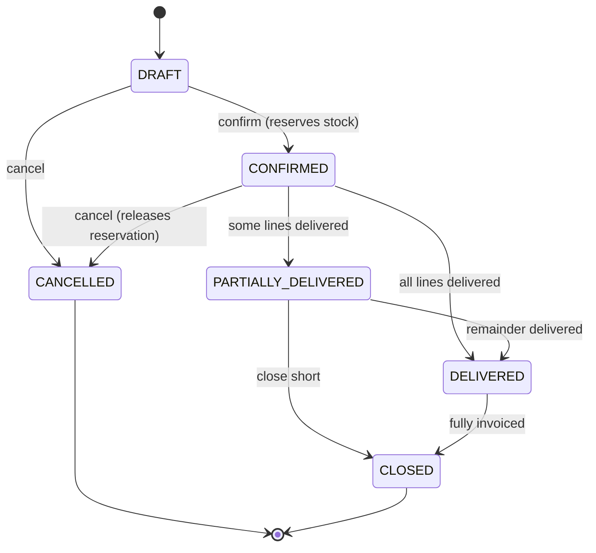
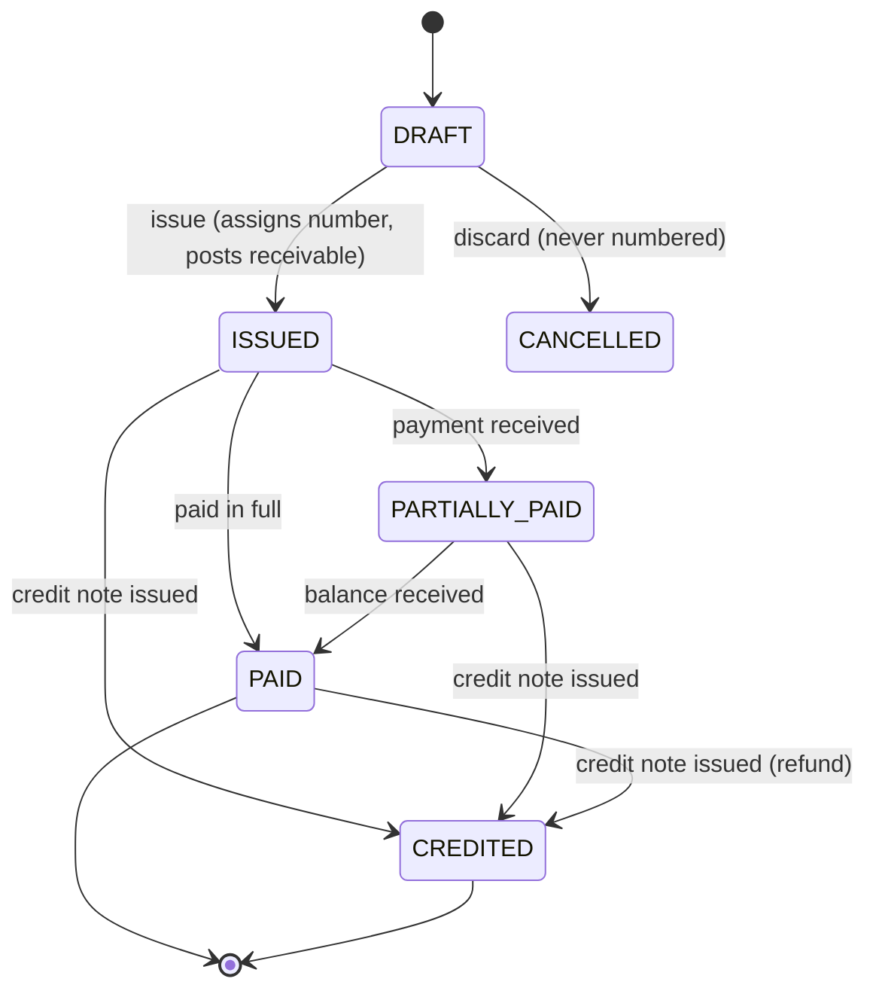
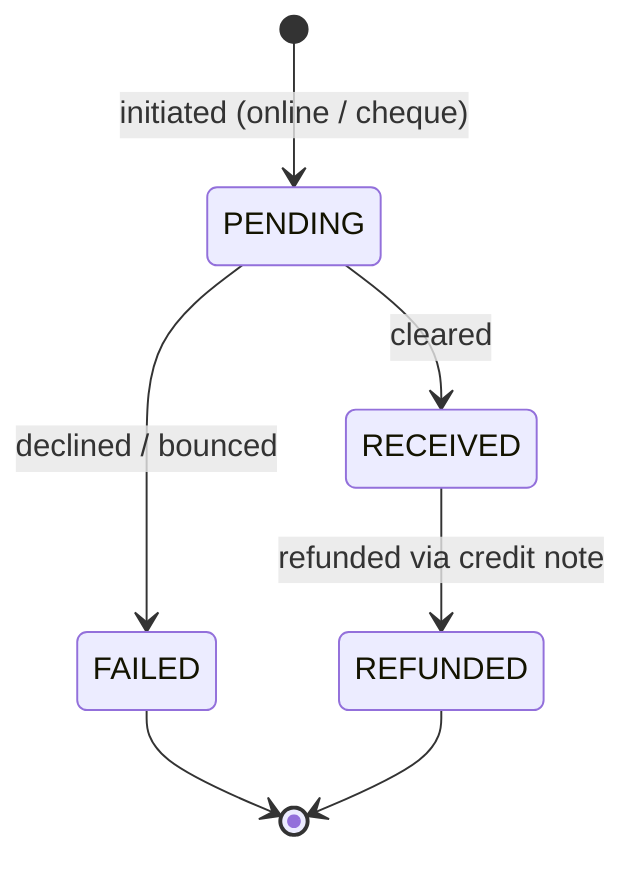

# Order to cash

Everything from a customer wanting an AC to the money being in our account.

**Status:** design. Nothing here is implemented yet except the parts marked `IMPLEMENTED`.
The [Open questions](#open-questions) at the bottom must be answered before building.

---

## Process

Two flows, and the design has to serve both. Getting this wrong — assuming everything is one
flow — is the single most common ERP modelling mistake.

**Counter sale.** Someone walks in, buys an AC, pays, carries it out. One document: an invoice.
No quotation, no order, no delivery note. If the design forces them through five documents to buy
one air conditioner, the design has failed and staff will work around it.

**Project / delivery sale.** A customer asks for a price → we quote → they confirm → we reserve
the stock so nobody else sells it → we deliver and install → we invoice → they pay, often
partially and late. Five or six documents, spread over weeks.

The same physical event (an AC leaving the building) happens in both, so both must produce the
same stock movement. The difference is only *which document* triggers it.

---

## Documents

| Document | Records | Stock effect | Money effect |
|---|---|---|---|
| **Quotation** | A price offered | none | none |
| **Sales Order** | Customer's confirmed intent | **reserves** (no physical move) | none |
| **Delivery Note** | Goods leaving the warehouse | **moves stock out**, releases reservation | none |
| **Invoice** | Demand for payment; the GST document | moves stock out *only for counter sales* | creates receivable |
| **Payment** | Money actually received | none | reduces receivable |
| **Credit Note** | Cancels/reduces an issued invoice | moves stock back in, if goods returned | reduces receivable |

Three things follow from that table:

**Reserving and moving are different.** A sales order promises stock; it doesn't touch it. Only a
delivery note (or a counter-sale invoice) physically moves it. `WarehouseStock.reserved_quantity`
already exists for exactly this and nothing writes to it today.

**Invoicing and delivering are different.** They usually happen together but not always — goods can
go out before billing, or be billed before dispatch. Keeping them separate is what lets a partial
delivery be invoiced correctly.

**An invoice is never edited after issue.** GST law requires a credit note. The existing `version` /
`parent` fields on `Invoice` are reaching for this, but versioning an issued tax document isn't the
same thing as crediting it — a credit note is itself a numbered document the customer receives.

---

## State machines

### Sales Order

`CLOSED` matters: a customer orders 10 units, takes 8, and says "forget the rest." The order isn't
cancelled and isn't fully delivered — it's closed short, and the 2 remaining units must have their
reservation released.

### Invoice

Note what's *not* here: no edge back into `DRAFT`. Once issued, an invoice has a legal number and
is immutable. Every correction goes through a credit note.

### Payment

`PENDING` earns its place because of the Pine Labs integration — an online payment is initiated,
then confirmed asynchronously by a callback. Cash is created directly as `RECEIVED`; a cheque sits
in `PENDING` until it clears, and can bounce.

---

## Invariants

Each names where it is enforced. **An invariant with no enforcement point is a future bug.**

| # | Rule | Enforced by |
|---|---|---|
| 1 | An issued invoice can never be modified | service guard on save + status check |
| 2 | Invoice numbers are unique and never reused | DB `unique` on `invoice_number` |
| 3 | Invoice number is assigned only on `DRAFT → ISSUED` | number-series service, in a transaction |
| 4 | `sum(line.line_total) == invoice.subtotal` | service, recomputed on every line change |
| 5 | `subtotal + tax_total - discount == grand_total` | service |
| 6 | `sum(allocations.amount) <= invoice.grand_total` | DB constraint + service |
| 7 | `invoice.paid_amount == sum(allocations for RECEIVED payments)` | derived, never stored raw |
| 8 | Warehouse stock can never go negative | `CheckConstraint(quantity >= 0)` |
| 9 | `reserved_quantity <= quantity` | `CheckConstraint` |
| 10 | `Product.quantity == sum(WarehouseStock.quantity)` | stock service; verifiable by query |
| 11 | Every stock change has a `StockMovement` row | only the stock service may write stock |
| 12 | Delivered quantity never exceeds ordered quantity | service guard |
| 13 | A credit note never exceeds the invoice it credits | service guard |
| 14 | Intra-state ⇒ CGST+SGST; inter-state ⇒ IGST; never both | tax service, from place of supply |
| 15 | `cgst_amount == sgst_amount` on every intra-state line | tax service |

Invariant 7 is a change from today: `paid_amount` currently sits on `Invoice` as an
independently-updated number, which can silently disagree with reality. Deriving it from payment
allocations makes disagreement impossible.

Invariant 11 is the one that makes all the stock rules hold. It is violated today —
`InvoiceItem.save()` writes `Product.quantity` directly, and `InvoiceSerializer.update()` does the
same in reverse.

---

## Schema

Full DBML in [`schema.dbml`](schema.dbml). The shape, and why:

**`SalesOrder.customer_id` replaces `customer_name` / `customer_phone`.** A real FK, so "what has
this customer ordered?" becomes answerable.

**`Invoice` gains `warehouse_id` and a nullable `sales_order_id`.** The warehouse is what lets the
invoice post stock through the proper service instead of reaching around it. The nullable order FK
is what keeps counter sales to a single document.

**`Invoice.updates_stock` (boolean).** `true` for counter sales — the invoice moves stock itself.
`false` when a delivery note already did. Without this flag, stock is either double-counted or
never moved, depending on which document you trust.

**Tax lives on the line, not the invoice.** Each `InvoiceLine` carries `hsn_code`, `gst_rate`, and
the computed `cgst_amount` / `sgst_amount` / `igst_amount`. GST returns need HSN-wise breakup, and
different products carry different rates, so a single invoice-level tax field cannot work. The
amounts are stored, not recomputed on read — a historical invoice must always show the tax it was
actually issued with, even if rates change later.

**`Payment` + `PaymentAllocation`.** One payment can settle several invoices, and one invoice can
receive several payments — so it's many-to-many through an allocation table carrying the amount.
This is what replaces the scalar `paid_amount`.

**`NumberSeries`.** One row per document type holding the last-used number, incremented under a row
lock. Replaces the `__regex` scan in `InvoiceSerializer._next_invoice_number()`, which races: two
concurrent invoices can read the same maximum and take the same number.

**Money is `decimal`, never float.** Amounts `decimal(14,2)`, tax rates `decimal(5,2)`.

---

## Migration from what exists

The current `Invoice` / `InvoiceItem` / `SalesOrder` are close enough to evolve rather than replace:

1. Add `Customer` FK to `SalesOrder`, backfilling by matching `customer_phone`. Keep the text
   columns until the backfill is verified, then drop them.
2. Add `warehouse` and nullable `sales_order` FKs to `Invoice`; default existing rows to the
   default warehouse.
3. Move stock posting out of `InvoiceItem.save()` and `InvoiceSerializer.update()` into the stock
   service. **Both must change together** — they're mirror images, and fixing only one leaves
   deduct and restore asymmetric, which is worse than the current consistent-but-wrong behaviour.
4. Add tax columns to `InvoiceItem`, defaulted to zero for historical rows.
5. Add `Payment` / `PaymentAllocation`; backfill one payment row per invoice with a non-zero
   `paid_amount`, then make `paid_amount` derived.
6. Add `NumberSeries`, seeded from the current maximum invoice number.
7. Replace invoice versioning with credit notes.

Each step is an ordinary Django migration. Steps 1–2 are safe to do now; 3 is the one that needs
tests first.

---

## Open questions

**These need business answers before implementation.** My recommendation is given, but these are
your calls — several change the schema structurally.

**1. Does stock leave on the delivery note or the invoice?**
→ *Recommend:* delivery note for order flow, invoice for counter sales, controlled by
`Invoice.updates_stock`. Handles both without double-counting.

**2. Is stock reserved when an order is confirmed?**
→ *Recommend:* yes. `reserved_quantity` already exists and is unused, and without it two staff can
promise the same unit to different customers.

**3. Are prices quoted GST-inclusive or GST-exclusive?**
→ *No default I can recommend* — retail in India is usually inclusive, B2B usually exclusive. This
changes what every price field *means* and how rounding works on every line. **If you sell both
retail and B2B, this must be a per-customer or per-price-list flag**, and that's structural.

**4. Can an invoice exist without a sales order?**
→ *Recommend:* yes, nullable FK. Counter sales are most of an AC dealer's volume.

**5. Partial deliveries — one order, several dispatches?**
→ *Recommend:* yes. It's why `Delivery Note` is a separate document rather than a flag on the order.
If you only ever deliver complete orders, the model simplifies a lot.

**6. Quotations — needed now?**
→ *Recommend:* design the entity, build it last. It's the least load-bearing document here.

**7. Returns — how common, and refund or credit?**
→ Affects whether `CreditNote` needs its own stock-return lines or can just reference the invoice's.

**8. Is quantity ever fractional?**
→ Whole units for ACs, but copper piping (metres) and gas (kg) are not. If those are ever sold as
line items, quantity must be `decimal(12,3)` everywhere and that decision cannot be deferred.

**9. Multi-currency?**
→ *Assuming no* — INR only. Say if not; it touches every money column.

**10. Does an installation job block invoicing?**
→ i.e. do you invoice on delivery or after installation? See [`05-service.md`](05-service.md).
