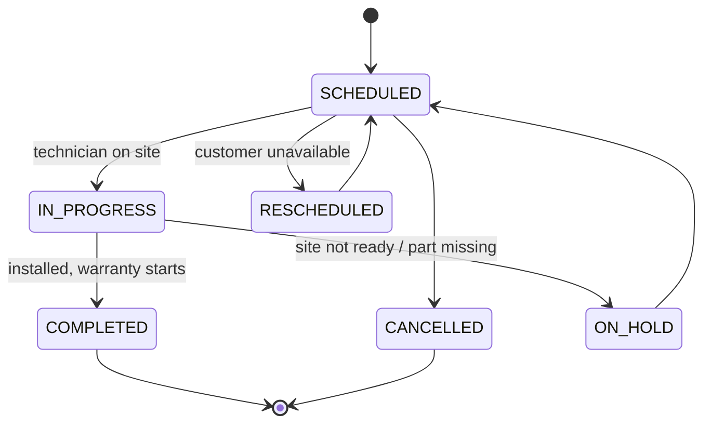
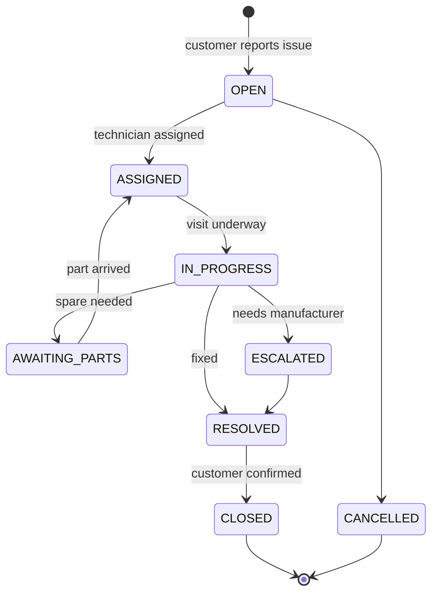

# Service, installation and warranty

Everything that happens to an AC after it leaves the warehouse.

**This module is specific to your business and it is not an add-on.** An AC is not a box you hand
over — it is delivered, installed by a technician, carries a warranty tied to its serial number, and
generates service calls and annual maintenance contracts for years. For an AC dealer this is a
substantial share of both revenue and customer contact.

It also drives a decision in another module: **warranty attaches to a physical unit, so it requires
serial-number tracking** ([04-inventory.md](04-inventory.md)). That is the main reason serials are
not optional.

**Status:** design. Nothing here is implemented.

---

## Process

A customer buys an AC → we deliver it → a technician installs it, usually a few days later, with
extra materials (copper piping, stabiliser, brackets) that are themselves billable → the warranty
period starts, typically from the installation date rather than the sale date → the customer calls
with a problem → we send a technician under warranty, or chargeably if out of it → some customers
buy an AMC covering scheduled servicing.

Two things about this shape are worth noticing early:

**Installation consumes stock and generates revenue.** Copper piping and brackets come out of the
warehouse and usually get billed. So an installation job is not just a calendar event — it can move
stock and create an invoice, which makes it a real document.

**Warranty usually starts at installation, not sale.** A unit sitting in a customer's house
uninstalled for six weeks shouldn't burn warranty. This means the installation job has to write back
to the serial number.

---

## Documents

| Document | Records | Stock effect | Money effect |
|---|---|---|---|
| **Installation Job** | Scheduled and completed install | consumes materials | may create an invoice |
| **Warranty Registration** | Warranty for one serial | none | none |
| **Service Request** | Customer reported a problem | none | none |
| **Service Job** | A technician visit | consumes spare parts | invoice if out of warranty |
| **AMC Contract** | Paid maintenance agreement | none | recurring receivable |

---

## State machines

### Installation Job

`RESCHEDULED` and `ON_HOLD` are not padding — "customer wasn't home" and "the wall needed drilling
we couldn't do" are the two most common real outcomes, and if the model can't express them, staff
will record installs as completed when they aren't.

### Service Request → Service Job

---

## Invariants

| # | Rule | Enforced by |
|---|---|---|
| 1 | A warranty belongs to exactly one serial number | DB `unique` |
| 2 | Warranty starts on installation completion, not sale | service, on `COMPLETED` |
| 3 | Materials used on a job write `StockMovement` rows | stock service only |
| 4 | A job cannot complete without recording materials used | service guard |
| 5 | Warranty coverage is decided by date, never manually flagged | derived at job creation |
| 6 | An AMC has exactly one active period at a time per unit | DB constraint |
| 7 | An out-of-warranty service job must produce an invoice | service guard |

Invariant 3 is the same rule as everywhere else: **only the stock service writes stock.** A
technician using two metres of copper is a stock movement exactly like a sale is.

Invariant 5 matters commercially — if warranty coverage is a flag someone sets, it will get set
wrongly, in the customer's favour, under pressure at the counter.

---

## Schema

Not yet in [`schema.dbml`](schema.dbml) — this module is deliberately last, pending the questions
below. Sketch:

- `installation_job` — FK to invoice/delivery note, customer, address, technician, scheduled date, status
- `installation_job_serial` — which units this job installs
- `installation_material` — parts consumed; posts stock movements
- `warranty` — one per serial: start date, months, type (manufacturer / extended), terms
- `service_request` — customer, serial, reported problem, status
- `service_job` — the visit: technician, findings, materials, in-warranty flag, invoice FK
- `amc_contract` + `amc_visit` — the agreement and its scheduled visits
- `technician` — probably a role on `User` rather than its own table

**Depends on:** `serial_number` ([04-inventory.md](04-inventory.md)) and `Address` on the customer
([01-master-data.md](01-master-data.md)). Both must land first — this module is unbuildable without
them.

---

## Open questions

**1. Do you install, or does the manufacturer?** → **This gates the entire module.** If Voltas or
Daikin sends their own technician, you need only a light warranty record and a way to log the
referral. If you install, everything above is in scope.

**2. Are technicians employees or contractors?** → Contractors need payout tracking per job, which is
a payables concern, not just scheduling.

**3. Is installation billed separately or included?** → Decides whether an installation job creates
its own invoice or attaches lines to the sale invoice.

**4. Does warranty start at sale or at installation?** → *Recommend:* installation. It's the
customer-fair answer and the industry norm, but it forces the write-back described above.

**5. Do you sell extended warranties?** → If yes, `warranty` needs a type and its own price, and
becomes a sellable line item — which makes it a product too.

**6. How are AMCs priced and scheduled?** Per unit or per customer? Fixed visit count or unlimited? →
Shapes `amc_contract` significantly.

**7. Do you need a technician-facing mobile view?** → Doesn't change the schema much, but changes the
API surface a lot. Worth knowing early.

**8. Do you stock spare parts distinctly from sellable products?** → *Recommend:* same `Product`
table with a flag. A compressor is a product you happen not to retail.

---

## Recommendation on sequencing

Design this module **now**, build it **last**.

Designing now costs a couple of hours and settles the serial-number question, which is the one
decision here that gets expensive to defer — every AC that arrives untracked is a unit you'd have to
physically audit later. Building now would be premature: order-to-cash and inventory are
prerequisites, and neither is finished.
